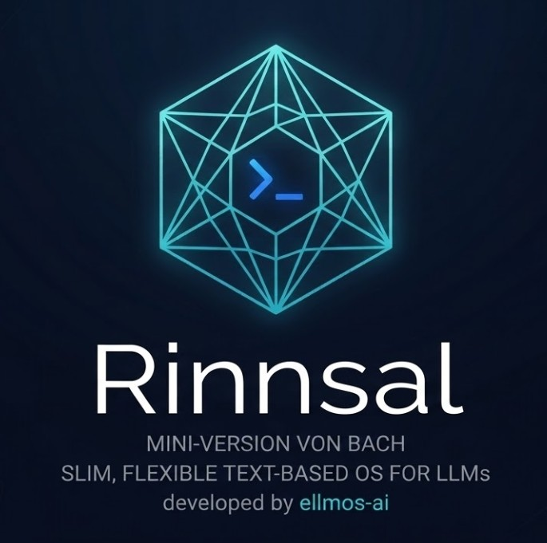

<p align="center">
  
</p>

# Rinnsal

**🇩🇪 [Deutsche Version](README_de.md)**

*The trickle -- lightweight LLM agent infrastructure by [ellmos-ai](https://github.com/ellmos-ai).*

Lightweight LLM agent infrastructure: **Memory**, **Connectors**, **Automation**.

Extracted from [BACH](https://github.com/lukisch) -- a comprehensive agent system with 73 handlers, 322 tools, and 24 protocols. Rinnsal takes only the infrastructure layer and leaves agent/skill/tool logic to the LLM providers.

## Features

- **Memory** -- Cross-agent shared memory with SQLite (facts, working memory, lessons learned, sessions)
- **Tasks** -- Simple task management with priorities, status tracking, and agent assignment
- **Connectors** -- Channel abstraction for Telegram, Discord, Home Assistant
- **Automation** -- LLM agent chain orchestration ("Marble-Run": sequential agent chains with loops, handoff, shutdown conditions)
- **Ollama** -- Local LLM runner for Ollama REST API (qwen3, mistral, etc.)
- **Zero dependencies** -- Pure Python stdlib, no external packages required
- **Python 3.10+**

## Install

```bash
pip install -e .
```

## Quick Start

### Memory

```python
from rinnsal.memory import api

api.init(agent_id="my-agent")
api.fact("system", "os", "Windows 11")
api.note("Aktueller Task: Feature implementieren")
api.lesson("UTF-8 Bug", "cp1252 Encoding", "PYTHONIOENCODING=utf-8", severity="high")

print(api.context())   # Kompakter Kontext fuer LLM-Prompts
print(api.status())    # Statistiken
```

### Tasks

```python
from rinnsal.tasks import api as tasks

tasks.init(agent_id="my-agent")
tasks.add("Implement feature X", priority="high", description="Details here")
tasks.add("Fix encoding bug", priority="critical")

for t in tasks.list():
    print(f"[{t['id']}] {t['title']} ({t['status']})")

tasks.activate(1)      # Set to 'active'
tasks.done(1)          # Mark as done
print(tasks.next_task())  # Next open task by priority
```

### Ollama (Local LLM)

```python
from rinnsal.auto.ollama_runner import OllamaRunner

ollama = OllamaRunner(model="qwen3:4b", base_url="http://localhost:11434")

if ollama.health():
    result = ollama.run("Explain this code")
    print(result["output"])

    # Chat with message history
    result = ollama.chat([
        {"role": "system", "content": "You are a helpful assistant."},
        {"role": "user", "content": "Hello!"}
    ])
    print(result["output"])

print(ollama.available_models())  # List installed models
```

### Connectors

```python
from rinnsal.connectors import load_connector

# Token via ENV: export RINNSAL_TELEGRAM_TOKEN=123:ABC...
tg = load_connector("telegram")
tg.connect()
tg.send_message("chat_id", "Hallo von Rinnsal!")
```

### Automation

```python
from rinnsal.auto.runner import ClaudeRunner

runner = ClaudeRunner(model="claude-sonnet-4-6")
result = runner.run("Analysiere den Code in src/")
print(result["output"])
```

## CLI

```bash
rinnsal status                           # Gesamtstatus
rinnsal version                          # Version

# Memory
rinnsal memory status                    # Memory-Statistiken
rinnsal memory fact system os "Win 11"   # Fakt speichern
rinnsal memory facts --json              # Alle Fakten (JSON)
rinnsal memory note "Meine Notiz"        # Notiz speichern
rinnsal memory context                   # LLM-Kontext generieren

# Tasks
rinnsal task add "My task" -p high          # Create task (critical/high/medium/low)
rinnsal task add "Bug fix" -d "Details"     # With description
rinnsal task list                           # Open/active tasks
rinnsal task list --all                     # Including done/cancelled
rinnsal task list --json                    # JSON output
rinnsal task show 1                         # Task details
rinnsal task done 1                         # Mark as done
rinnsal task activate 1                     # Set to active
rinnsal task cancel 1                       # Cancel task
rinnsal task reopen 1                       # Reopen done/cancelled
rinnsal task delete 1                       # Delete permanently
rinnsal task count                          # Count by status

# Chains (Automation)
rinnsal chain list                       # Ketten auflisten
rinnsal chain start mein-projekt         # Kette starten
rinnsal chain status                     # Status aller Ketten
rinnsal chain stop mein-projekt          # Kette stoppen
rinnsal chain log mein-projekt           # Log anzeigen
rinnsal chain reset mein-projekt         # Zuruecksetzen
rinnsal chain create                     # Interaktiv erstellen

# Connectors
rinnsal connect list                     # Verfuegbare Connectors
rinnsal connect test telegram            # Verbindungstest
rinnsal connect send telegram ID "Text"  # Nachricht senden

# Pipe (Einzelaufruf)
rinnsal pipe "Erklaere diesen Code"      # Einzelner LLM-Aufruf
```

## Configuration

Rinnsal sucht die Config in folgender Reihenfolge:

1. `./rinnsal.json` (aktuelles Verzeichnis)
2. `~/.rinnsal/config.json` (User-Home)

Secrets werden ausschliesslich via ENV-Variablen gesetzt:

```bash
export RINNSAL_TELEGRAM_TOKEN="123456:ABC-DEF..."
export RINNSAL_DISCORD_TOKEN="..."
export RINNSAL_HA_TOKEN="..."
```

Beispiel-Config: siehe `config/rinnsal.example.json`

## Architecture

```
rinnsal/
├── memory/        # SQLite-based cross-agent memory (from USMC)
├── tasks/         # Task management with SQLite (priorities, status)
├── connectors/    # Messaging channel abstraction (from BACH)
├── auto/          # LLM agent chain orchestration + OllamaRunner
└── shared/        # Config loader, event bus
```

### Component Integration

```
Memory <-> Auto:       Chains read/write context from Memory (opt-in)
Connectors <-> Auto:   Telegram notifications via Connector
Event Bus:             Decoupling layer between components
```

## See Also: OpenClaw

How does Rinnsal compare to [OpenClaw](https://github.com/openclaw/openclaw), the popular open-source AI assistant (274K+ stars)?

| | **Rinnsal** | **OpenClaw** |
|---|---|---|
| **Focus** | Minimal infrastructure layer -- Memory, Connectors, Automation | Full AI assistant -- 20+ messengers, native apps, voice, skill marketplace |
| **Philosophy** | Provide building blocks, let the LLM handle the rest | All-in-one ecosystem with community-driven extensions |
| **Memory** | Structured SQLite (facts, lessons, working memory, sessions) | Session-based with `/compact`, workspace files |
| **Connectors** | Telegram, Discord, Home Assistant (same abstraction pattern, growing) | 20+ platforms (WhatsApp, Slack, Signal, Teams, Matrix...) |
| **Dependencies** | Zero -- pure Python stdlib | Node.js 22+, numerous npm packages |
| **License** | MIT | MIT |

**In short:** Rinnsal and OpenClaw share the same connector gateway pattern, but take opposite approaches to complexity. Rinnsal stays minimal with zero dependencies and structured memory. OpenClaw goes all-in with native apps, voice, and a massive community. Different starting points, potentially converging on connectors.

## License

MIT -- Lukas Geiger

---

## Haftung / Liability

Dieses Projekt ist eine **unentgeltliche Open-Source-Schenkung** im Sinne der §§ 516 ff. BGB. Die Haftung des Urhebers ist gemäß **§ 521 BGB** auf **Vorsatz und grobe Fahrlässigkeit** beschränkt. Ergänzend gelten die Haftungsausschlüsse aus GPL-3.0 / MIT / Apache-2.0 §§ 15–16 (je nach gewählter Lizenz).

Nutzung auf eigenes Risiko. Keine Wartungszusage, keine Verfügbarkeitsgarantie, keine Gewähr für Fehlerfreiheit oder Eignung für einen bestimmten Zweck.

This project is an unpaid open-source donation. Liability is limited to intent and gross negligence (§ 521 German Civil Code). Use at your own risk. No warranty, no maintenance guarantee, no fitness-for-purpose assumed.

