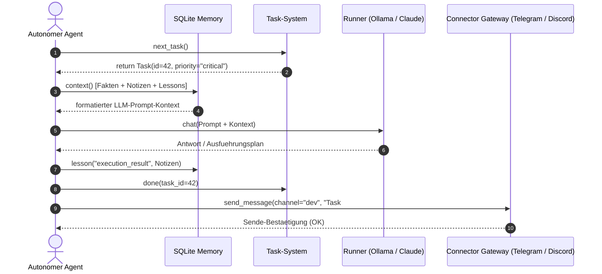

# Architektur

## Ueberblick

Rinnsal besteht aus fuenf unabhaengigen Modulen plus einer gemeinsamen Infrastrukturschicht:

```
rinnsal/
├── memory/        ← SQLite-basiertes agentenuebergreifendes Gedaechtnis (USMC-Ursprung)
├── tasks/         ← Aufgabenverwaltung mit Prioritaeten & Status (Seam zu taskplan)
├── connectors/    ← Messaging-Kanalabstraktion (BACH Connector Framework)
├── auto/          ← MarbleRun-Engine + Ollama-Runner (Lokale Kettenorchestrierung)
├── i18n/          ← Lokalisierungskatalog (de/en/es/zh/ja/ru)
└── shared/        ← Konfiguration + Event-Bus
```

## Design-Prinzipien

1. **Zero Dependencies** -- Nur Python stdlib. Kein `requests`, `aiohttp`, etc.
2. **Modular** -- Jede Komponente ist einzeln nutzbar.
3. **ENV-basierte Secrets** -- Keine Secrets in Dateien oder Datenbanken.
4. **Konfigurierbar** -- Zentrales `rinnsal.json`, Suchpfade: `./` und `~/.rinnsal/`.

## Komponenten-Integration

```
┌─────────┐      ┌──────────────┐      ┌──────────┐
│ Memory  │◄────►│  Auto/Chain  │◄────►│Connectors│
│ (SQLite)│      │  (Marble-Run)│      │(Telegram,│
└────┬────┘      └──────┬───────┘      │ Discord) │
     │                  │              └────┬─────┘
     │      ┌───────────┼───────────────────┤
     ▼      ▼           ▼                   │
┌──────────────┐  ┌──────────┐              │
│ Tasks-Seam   │  │ Event-Bus│◄─────────────┘
│ (rinnsal/    │  └──────────┘
│  taskplan)   │
└──────────────┘
```

- **Memory ↔ Auto**: Chain-Engine liest optional Kontext aus Memory, schreibt Ergebnisse zurueck.
- **Tasks ↔ Auto**: Agenten beziehen naechste offene Aufgaben prioritaetsbasiert via Task-Engine.
- **Connectors ↔ Auto**: Benachrichtigungen nach Chain-Links via Connector-Gateway.
- **Event-Bus**: Entkopplungsschicht fuer komponentenuebergreifende Events.

## Agenten-Interaktionssequenz



## State-Management

Chain-State wird im Dateisystem gespeichert (`~/.rinnsal/state/<chain>/`):

| Datei | Inhalt |
|---|---|
| `status.txt` | RUNNING, STOPPED, COMPLETED, ALL_DONE, READY |
| `round_counter.txt` | Aktuelle Rundennummer |
| `start_time.txt` | ISO-Startzeit |
| `handoff.md` | Agent-zu-Agent Uebergabe-Dokument |
| `STOP` | Stop-Marker (Existenz = Stop angefordert) |
